This repository is prepared for C++ Cheat Sheet along with the example codes.

[TOC]

# 1. Arrays

Data structures that hold multiple variables of the same data type.

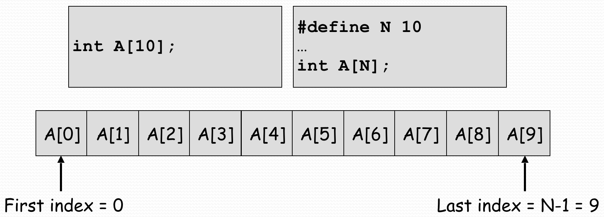


### [Uninitialized Elements Are Zero](http://tpcg.io/iY01WA)

If all elements of the array are not initialized, the rest will be set to 0.

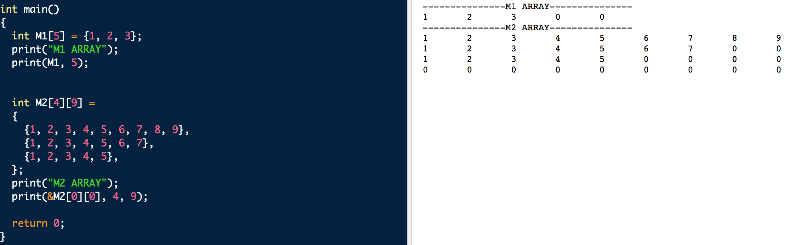


### [Pass Array To Functions](http://tpcg.io/BeBk25)

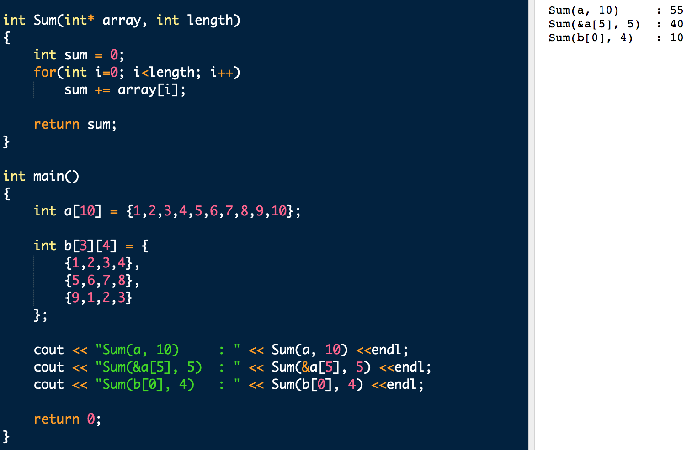

# 2. Pointers

Stores memory addresses. Address of a variable can be obtained by the 'address of' operator (&) .

All pointers have the same size. A pointer occupy 4 Bytes in 32-bit machines, 8 Bytes in 64-bit machines.

Since the content of a pointer is a memory address, we can visualize a pointer pointing to the data object whose address it contains.

`nullptr` means an **invalid memory address.**

```c++
char*  p  = &c1;
char*  q  = &c2;
short* ps = &s;
int*   pi = &i;
```

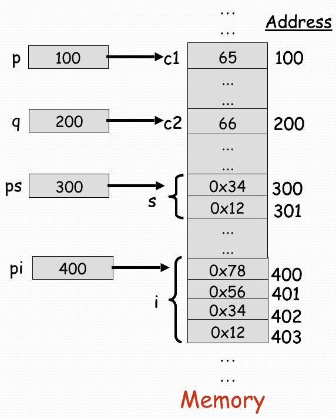

### [Cast](http://tpcg.io/pxHcKc)

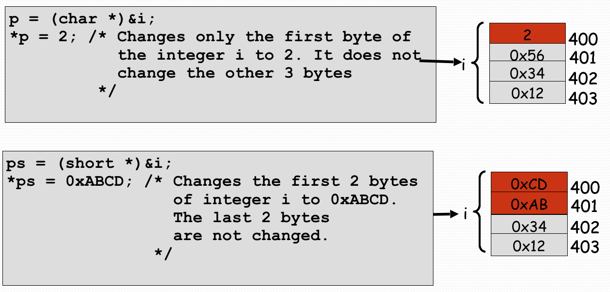

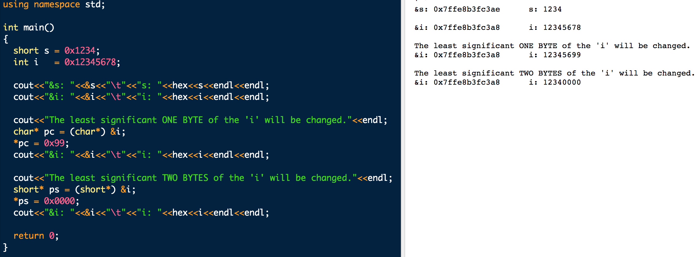

### Pointer To Pointer

Pointers have memory addresses. This means that I can have another pointer that contains the memory address of a pointer. This would be called a pointer to pointer.

```c++
char A = 'A';
char B = 'B';
char* p = &A;
char** pp = nullptr;

pp = &p;
*pp = &B;
**pp = 'R';
```

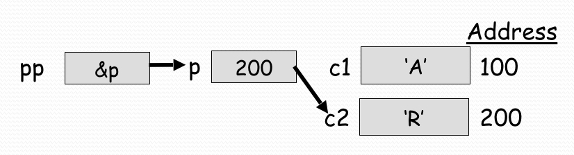

### [Generic Pointer (void*)](http://tpcg.io/e6mSGU)

It is used when the type of object stored at a memory location is not known. Hence, it can not dereferenced directly. Typecasting to a known pointer type is necessary. This allows the compiler to determine how many bytes to access.

```c++
// Typecast first, dereference later.
*( (int*) pv ) = 70;
```

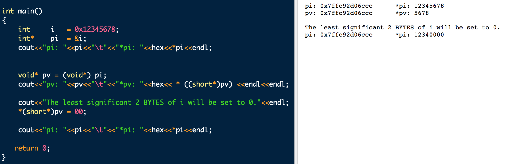

### [Function Pointers](http://tpcg.io/5N3aoV)

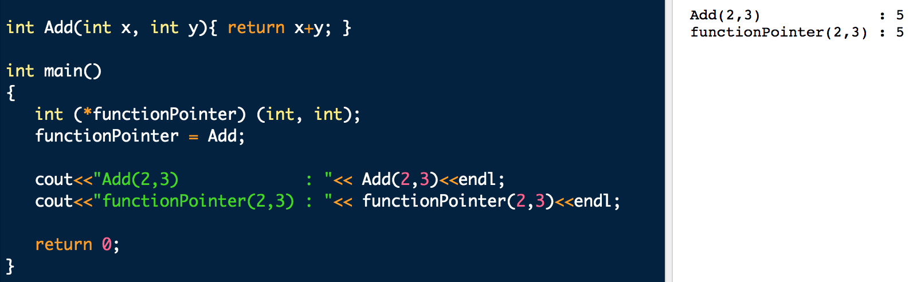

# 3. Pointer Arithmetic

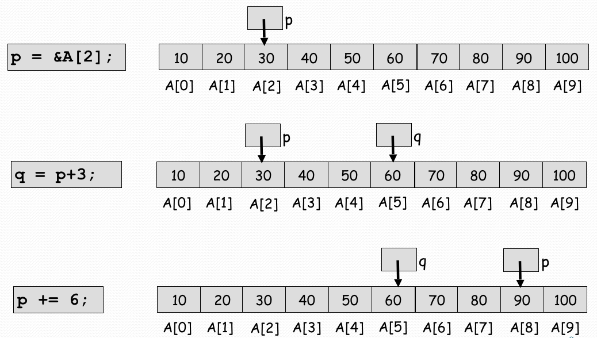

### [Pointer Arithmetic Example](http://tpcg.io/SJswzo)

To understand example code better. Please visit [the difference between x++ and ++x blog post](https://dev.to/somedood/the-difference-between-x-and-x-44dl).

> The prefix and postfix increment both increase the value of a number by 1. The only difference between the two is their return value. The former increments (`++`) first, then returns the value of `x`, thus `++x`. The latter returns the value of `x` first, then increments (`++`), thus `x++`.

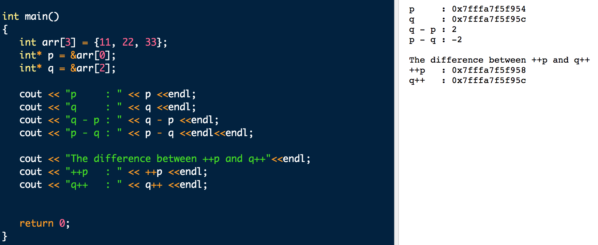


The array name M corresponds to the address of the first element of the array `M[0][0]`.

``` cpp
M    == &M[0][0]
M[1] == &M[1][0]
M[2] == &M[2][0]
```

# 4. Strings

A string is an array of characters terminated by the NULL char ('\0').

```cpp
// Unspecified array elements are filled with 0, that is, the NULL char. 
char str[8] = {'a', 'b', 'c'};

// String literal.
char str[8] = "abc";

// The compiler will allocate as many chars as the length of the string + NULL character.
char str[]  = "abc";

// Cannot be modified, READ-ONLY
char* str   = "abc";
```

### Array of Strings

```cpp
char* planets[] = {"Mercury", "Venus", "Earth", 
                   "Mars", "Jupiter", "Saturn", 
                   "Uranus", "Neptune", "Pluto"};
```

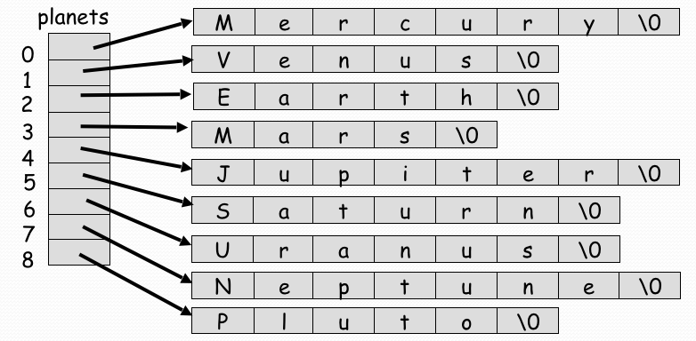

### Reading Strings

```cpp
string name("World");

char customer[8];
cin.getline(customer, 8);

string str;
getline(cin, str);
```

# 5. Dynamic Memory Allocation

Dynamically allocate as much space as needed during execution.

The `new` operator returns address of memory location.

The `delete` operator frees the memory allocated for the pointer.

ANY `new` MUST HAVE A CORRESPONDING `delete`. IF NOT, THE PROGRAM HAS MEMORY LEAK.

```cpp
int* var = new int;
int* arr = new int[5];

delete var;
delete[] arr;
```

# [6. Structure (Record)](http://tpcg.io/zNV90V)

Data frequently occurs in groups. Store variables with dissimilar types together in a container called structure.

```cpp
typedef struct Student{
  string name;
  string id;
  float gpa;
};

Student student   = {"NAME", "ID", 0.00};
Student* pStudent = &student;

student.name		= "safak";
pStudent->.id		= "12345";
(*pStudent).gpa = 3.74;

// Array of Structures
Student students[2];
Student* students = new Student[2];
```

# [7. File IO](https://repl.it/@safak17/ComputerProgramming-7-FileIO)

A file is a collection on information, usually stored on a computer’s disk.

- In a **text file**, the bytes represent characters (typically ASCII) making it possible for a human to examine the file or edit it using a text editor.
- In a **binary file**, bytes do not necessarily represent characters. Groups of bytes might represent an int, float, double etc.

Windows uses two chars to mark the end of a line **\r(13)\n(10)**. Unix-based OSs do not differentiate between text&binary files, both types of files are stored the same way.

`ios` is the base class that contains constants and member functions common to input and output operations.

`istream` get(), getline(), read(), >> operator

`ostream` put(), write(), << operator

`iostream` inherits from both `istream` and `ostream`

Before data can be written to or read from a file, the file must be opened with the corresponding [file mode](https://www.tutorialspoint.com/cplusplus/cpp_files_streams.htm).

```cpp
if( file.fail() )
if( !file )
if( ! file.is_open() )
  
//	file.eof() returns true when there is no more information to be read.
while( ! file.eof() )	
  
file.read( (char*) buffer, sizeof(buffer));
file.write((char*) buffer, sizeof(buffer));
```
